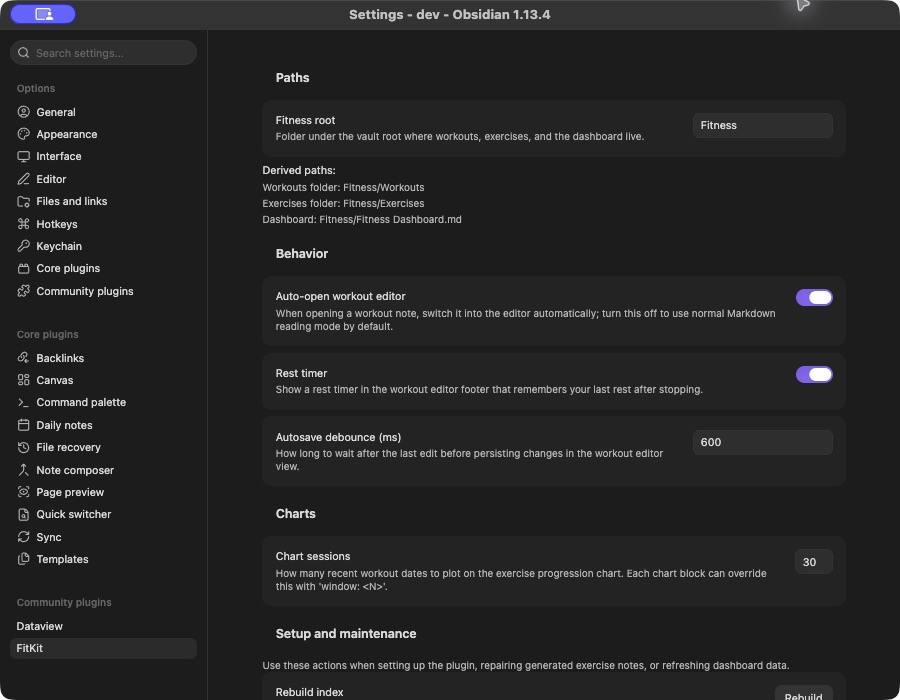
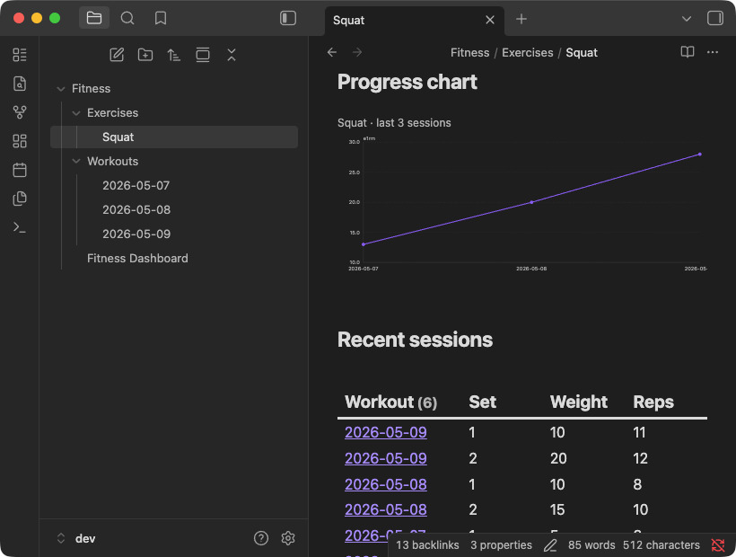

# FitKit

FitKit is a workout tracker that lives inside Obsidian. Your sets, reps, weight, and rest timing are stored as plain Markdown in your vault, edited through a fast structured form, and rolled up into a dashboard and per-exercise progression charts.

## Why FitKit

- **Your data stays as Markdown.** Every workout is a normal note with Dataview inline fields. No SQLite blob, no proprietary export, no cloud account. If you uninstall FitKit tomorrow, your training history is still plain text in your vault.
- **The editor is built for the gym.** Tap to add a set, type the weight, hit the rest timer. You are not editing Markdown between sets, you are using a form that writes Markdown for you.
- **PBs and progression are automatic.** Once you have logged a few workouts, FitKit generates a dashboard with personal bests and a Dataview-powered history per exercise. Exercise notes get a progression chart and a recent-sessions table without you wiring anything up.
- **It is just an Obsidian plugin.** It works with the rest of your vault: link exercises to your training notes, embed charts in a daily note, query workouts with your own Dataview queries.

If you want a workout tracker that is yours, that you can read and edit in any text editor, and that does not silo your training history behind an app, FitKit is built for that.

## Install

FitKit needs the [Dataview plugin](https://github.com/blacksmithgu/obsidian-dataview) to render history tables and recent-session views. Install Dataview first from Obsidian's community plugins.

To install FitKit with the [BRAT community plugin](https://github.com/TfTHacker/obsidian42-brat):

1. Install BRAT.
2. Add `https://github.com/paulchiu/obsidian-fitkit` as a beta plugin.
3. Enable FitKit from Obsidian's community plugins list.

To install manually from a release:

1. Download `main.js`, `manifest.json`, and `styles.css` from the release.
2. Put them in `<vault>/.obsidian/plugins/fitkit/`, creating the folder if needed.
3. Reload Obsidian, then enable FitKit from the community plugins list.

## Log your first workout

The defaults are designed so you can log a workout the moment FitKit is enabled. No setup is required.

1. **Open the command palette** and run `Open today's workout`. FitKit creates today's note under `Fitness/Workouts/` and opens it in the structured workout editor.

   

2. **Add an exercise.** Type the name (for example, `Squat`). If it is a new exercise, FitKit asks whether to create an exercise note for it. Say yes for anything you want to chart and revisit later.

3. **Log your sets.** Enter weight and reps for each set, or a duration in seconds for time-based exercises. Tap the rest timer between sets if you want it.

4. **That is it.** The editor autosaves the note as you go. The underlying Markdown looks like this:

   ```markdown
   ---
   type: workout
   date: 2026-05-12
   name: Squat Day
   ---

   ## [[Squat]]

   - [exercise:: [[Squat]]] [set:: 1] [weight:: 50] [reps:: 5]
   - [exercise:: [[Squat]]] [set:: 2] [weight:: 55] [reps:: 5]
   ```

After a few sessions, run `Rebuild dashboard` from FitKit settings to generate `Fitness/Fitness Dashboard.md` with your PBs and per-exercise history. Exercise notes pick up a progression chart and a `Recent sessions` table automatically.

## Settings and defaults



The default root is `Fitness`, which gives you:

- `Fitness/Workouts/` for workout notes.
- `Fitness/Exercises/` for exercise notes.
- `Fitness/Fitness Dashboard.md` for the generated dashboard.

Change `Fitness root` only if you want those files somewhere else in your vault.

Other settings worth knowing:

- `Auto-open workout editor`: open workout notes in the FitKit editor by default.
- `Rest timer`: show the workout editor rest timer.
- `Auto-update dashboard on save`: refresh dashboard data after workout saves.
- `Chart sessions`: default number of recent sessions to plot in exercise charts.

## Dashboard and exercise notes




`Rebuild dashboard` scans your workout notes, updates the local index, and regenerates the dashboard with PBs and per-exercise Dataview queries.

Exercise notes are normal Markdown files with `type: exercise` frontmatter. FitKit can seed them with:

- A `fitkit-chart` progression chart.
- A Dataview-powered `Recent sessions` section.
- A `Notes` section for your own training notes.

Use `Sync and repair exercise notes` if you already have exercise notes and want FitKit to add or refresh the generated sections. Use `Import exercises` when you have workout history and want FitKit to create missing exercise notes or registry entries from the names it finds.

## Commands

The command palette is reserved for daily workout entry.

| Command                                | Description                                                                |
| -------------------------------------- | -------------------------------------------------------------------------- |
| `Open today's workout`                 | Create today's workout note if needed, then open it in the workout editor. |
| `Open workout editor for current file` | Open the active Markdown file in the workout editor.                       |

## Maintenance actions

The settings tab has maintenance actions for generated data and diagnostics:

- `Rebuild index`: rescan workout notes into the local index.
- `Rebuild dashboard`: regenerate `Fitness/Fitness Dashboard.md` from the index.
- `Restore hidden dashboard sections`: bring back per-exercise sections you have hidden.
- `Show parse diagnostics`: list workout notes that failed to parse cleanly.
- `Show exercise registry diagnostics`: report registry inconsistencies.
- `Sync and repair exercise notes`: insert or refresh charts, `Recent sessions`, and `Notes` blocks in existing exercise notes.
- `Import exercises`: scan workout history for missing exercise notes and registry entries.

## Workout note format

Workout notes use `type: workout` frontmatter. Exercise notes use `type: exercise` frontmatter. Those fields are the discriminator FitKit uses to decide which notes are canonical workout or exercise files.

Dataview inline fields are the canonical workout format:

```markdown
[exercise:: [[Name]]] [set:: N] [weight:: X] [reps:: Y]
[exercise:: [[Name]]] [duration:: S]
[exercise:: [[Name]]] [notes:: text] [next:: up 2.5]
```

Durations are stored as seconds. Fenced code blocks are reporting surfaces, not the source of truth.

`next::` records how you want to load the exercise next session: `up`, `down`, or `stay`, with an optional weight change (`up 2.5`). FitKit writes it from the workout editor and shows it on the exercise card the next time that exercise comes up. A value it cannot read is ignored rather than reported, and, like any other inline field FitKit does not recognise, it is dropped the next time the workout editor saves that note.

## Limitations

- Conflict resolution is still manual. FitKit detects mid-edit file changes and asks you to reload before further edits.
- SQL/WASM analytics are not implemented.
- A custom fenced source format is not implemented.
- Repeat-last-workout is not implemented.
- Strength exercises can use a per-exercise weight unit (`kg` or `lbs`) from the exercise registry editor or `unit:` frontmatter. It defaults to kg and only changes labels, with no numeric conversion.

## Development

Run `npm install` to install dependencies.

Run `npm run dev` to start esbuild in watch mode. It produces `main.js` next to `manifest.json` at the repo root.

To point a dev vault at the build, symlink `main.js`, `manifest.json`, and `styles.css` from the repo root into `<vault>/.obsidian/plugins/fitkit/`. Reload Obsidian, or toggle the plugin off and on, to pick up new builds.

The local gate is `npm test`, `npm run lint`, and `npm run format`. Run all three before pushing.

On merge to `main`, the Release workflow stamps a version using the PR's label (`major`, `minor`, `patch`, or `norelease`) and publishes a GitHub release with `main.js`, `manifest.json`, and `styles.css` attached.

See `AGENTS.md` for project conventions.

## License

MIT.
