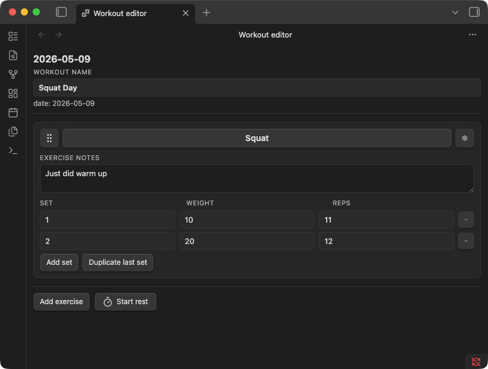
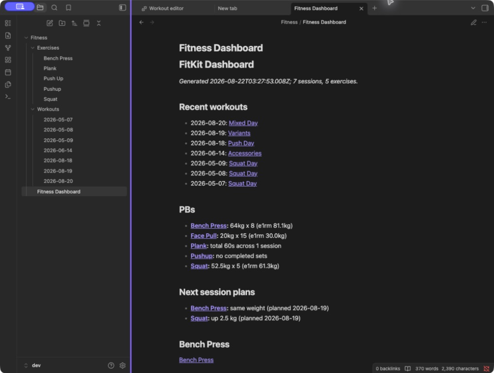
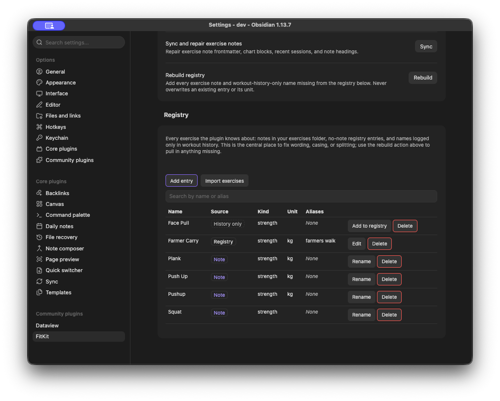

# FitKit

FitKit is a workout tracker that lives inside Obsidian. Your sets, reps, weight, and durations are stored as plain Markdown in your vault, edited through a form built for the gym, and rolled up into a dashboard and per-exercise progression charts.

Every workout is a normal note with Dataview inline fields. No SQLite blob, no proprietary export, no cloud account. If you uninstall FitKit tomorrow, your training history is still plain text in your vault, readable in any editor. It is a plugin, so the rest of your vault can reach it: link exercises to your training notes, embed a chart in a daily note, or query your history with your own Dataview queries.

The editor is the part you touch mid-session. Tap to add a set, type the weight, hit the rest timer. Once you have a few workouts logged, the dashboard and the per-exercise charts fill themselves in.

## Install

FitKit needs the [Dataview plugin](https://github.com/blacksmithgu/obsidian-dataview) to render history tables and recent-session views. Install it first from Obsidian's community plugins.

FitKit is not in the community plugin directory yet, so this path works once it is listed.

To install FitKit from Obsidian's community plugins browser:

1. Open Settings, then Community plugins, then Browse.
2. Search for FitKit.
3. Select Install, then Enable.

To install FitKit with the [BRAT community plugin](https://github.com/TfTHacker/obsidian42-brat):

1. Install BRAT.
2. Add `https://github.com/paulchiu/obsidian-fitkit` as a beta plugin.
3. Enable FitKit from Obsidian's community plugins list.

To install manually from a release:

1. Download `main.js`, `manifest.json`, and `styles.css` from the release.
2. Put them in `<vault>/.obsidian/plugins/fitkit/`, creating the folder if needed.
3. Reload Obsidian, then enable FitKit from the community plugins list.

## Log your first workout

The defaults are designed so you can log a workout the moment FitKit is enabled. No setup is required.



1. Run `Open today's workout` from the command palette. FitKit creates today's note under `Fitness/Workouts/` and opens it in the editor.
2. Add an exercise. Type the name, for example `Squat`. If it is new, FitKit asks whether to create an exercise note for it; say yes for anything you want to chart and revisit later.
3. Log your sets: weight and reps for a strength exercise, or a duration for a time-based one. Tap the rest timer between sets if you want it.
4. Before you move on, open the card menu and set a plan for next session: increase, keep, or decrease, with an optional weight step. It shows up as a badge on the card, and prefills the weight the next time that exercise comes around.

That is it. The editor autosaves as you go, and the underlying Markdown stays readable:

```markdown
---
type: workout
date: 2026-05-12
name: Squat Day
---

## [[Squat]]

- [exercise:: [[Squat]]] [set:: 1] [weight:: 50] [reps:: 5]
- [exercise:: [[Squat]]] [set:: 2] [weight:: 55] [reps:: 5]
```

## After a few sessions

Run `Rebuild dashboard` from FitKit's settings to generate `Fitness/Fitness Dashboard.md`. It lists your recent sessions, a personal best per exercise, and any next-session plans you recorded, followed by a per-exercise section backed by a Dataview query.



Exercise notes pick up a progression chart and a `Recent sessions` table without you wiring anything up. They are ordinary notes with `type: exercise` frontmatter, so the `Notes` section is yours to write in.

## Maintaining your exercise list

Names drift. You log 'Pushup' one week and 'Push Up' the next, or an exercise ends up living only in workout history with no note behind it. The registry in FitKit's settings lists every exercise the plugin knows about, labelled by where it came from, and is where you fix that.



Renaming from here renames the exercise note, rewrites every reference across your workout notes, and keeps the old name as an alias so nothing stops resolving. You see a preview of every file and row that will change, and can cancel before anything is written. Renaming onto a name already in use consolidates the two.

## Documentation

| Page                                                 | What it covers                                                                   |
| ---------------------------------------------------- | -------------------------------------------------------------------------------- |
| [Workout editor](docs/workout-editor.md)             | Cards, sets, durations, the rest timer, next-session plans, autosave.            |
| [Exercise registry](docs/exercise-registry.md)       | Where exercises come from, rebuilding, renaming, consolidating, kinds and units. |
| [Dashboard and charts](docs/dashboard-and-charts.md) | What the dashboard generates, how a PB is chosen, `fitkit-chart` options.        |
| [Note format](docs/note-format.md)                   | Frontmatter, inline fields, and exactly what survives a save.                    |
| [Settings and maintenance](docs/settings.md)         | Every setting, every maintenance action, and the two commands.                   |

## Limitations

- Conflict resolution is manual. FitKit detects mid-edit file changes and asks you to reload before further edits.
- Splitting one exercise into two is not implemented. Consolidating two into one is.
- Repeat-last-workout is not implemented.
- Inline fields FitKit does not recognise, such as `[rpe:: 7]`, are dropped the next time the editor saves that note. Everything else in a workout note is preserved, see [Note format](docs/note-format.md#what-survives-a-save).
- A per-exercise weight unit (`kg` or `lbs`) only changes labels. There is no numeric conversion.
- SQL/WASM analytics and a custom fenced source format are not implemented.

## Development

Run `npm install` to install dependencies.

Run `npm run dev` to start esbuild in watch mode. It produces `main.js` next to `manifest.json` at the repo root.

To point a dev vault at the build, symlink `main.js`, `manifest.json`, and `styles.css` from the repo root into `<vault>/.obsidian/plugins/fitkit/`. Reload Obsidian, or toggle the plugin off and on, to pick up new builds.

The local gate is `npm test`, `npm run lint`, and `npm run format`. Run all three before pushing.

On merge to `main`, the Release workflow stamps a version using the PR's label (`major`, `minor`, `patch`, or `norelease`) and publishes a GitHub release with `main.js`, `manifest.json`, and `styles.css` attached.

See `AGENTS.md` for project conventions.

## License

MIT.
