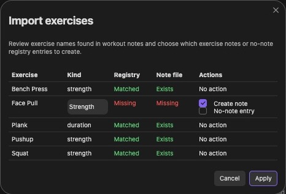
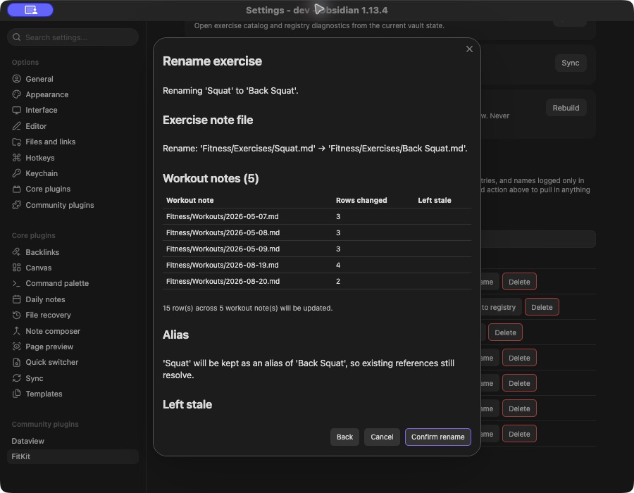
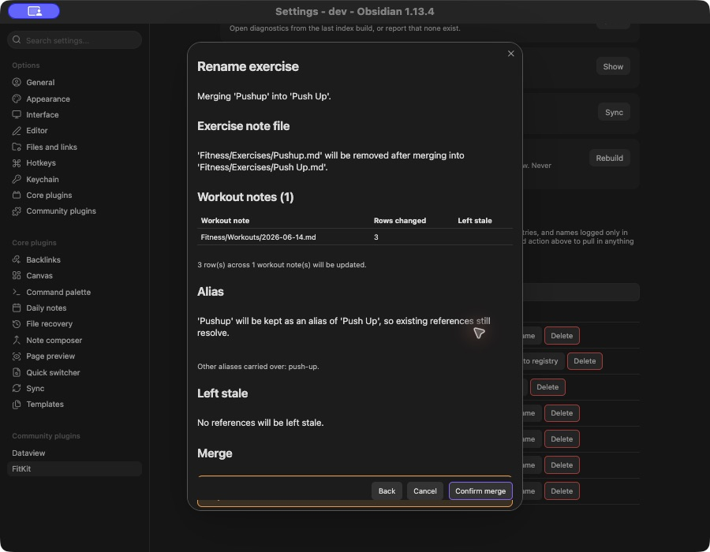

# Exercise registry

The registry lives at the bottom of FitKit's settings tab. It lists every exercise the plugin knows about and is where you fix wording, casing, and duplicates.

## Where exercises come from

An exercise can reach FitKit three ways, and the `Source` column says which:

- `Note` is a Markdown file in your exercises folder with `type: exercise` frontmatter. The filename is the display name. Hover the badge for the path.
- `Registry` is a no-note entry, useful for something you log but do not want a note for.
- `History only` is a name that appears in `[exercise:: [[Name]]]` rows somewhere in your workouts and nowhere else.

Notes win on read. Where a note and a registry entry both describe the same exercise, the note's name, kind, and unit are what the rest of the plugin uses, and the registry entry supplies whatever the note leaves out.

Row actions follow the source. A note-backed row offers `Rename`, a history-only row offers `Add to registry`, and a no-note entry offers `Edit`. Every row offers `Delete`.

The search box above the table matches on name and on aliases, so searching 'push-up' finds the exercise you consolidated under 'Push Up'.

## Filling in what is missing

`Rebuild registry`, under `Setup and maintenance`, adds every exercise note and history-only name that is not already in the registry, and adds nothing else.

- Existing entries, aliases, kinds, and units are left exactly as you curated them.
- A name already recorded as an alias of another entry is not re-added as its own entry.
- Exercises you deleted stay deleted.
- Running it twice changes nothing the second time.

Backfilled entries deliberately carry no unit, because an explicit registry unit is what `Sync and repair exercise notes` writes into note frontmatter, and inventing one would stamp a unit you never chose onto your notes.

`Import exercises`, the button beside `Add entry`, is the interactive version. It lists names found in workout notes with their registry and note-file status, and lets you choose per exercise whether to create a note, a no-note entry, or neither.

## Renaming an exercise

`Rename` on a note-backed row renames the exercise everywhere, after showing you exactly what it will touch.

Confirming does four things:

- Renames the exercise note file.
- Rewrites `[exercise:: [[Name]]]` fields and `## [[Name]]` headings across your workout notes.
- Regenerates the note's Dataview queries for the new name.
- Keeps the old name as an alias, so anything still referring to it resolves.

Matching is anchored on the wikilink brackets and required to equal the name exactly, case-insensitively. Renaming 'Row' catches `[[row]]` and leaves 'Barbell Row' and 'Cable Row' alone. Fenced code blocks are never touched.

Pathed and aliased wikilinks (`[[Folder/Row]]`, `[[Row|Rowing]]`) are the exception. Deciding whether one of those points at this exercise needs real link resolution, so rather than guess, the preview counts them under `Left stale` and leaves them as they are.

The rename is refused, with the reason, when the new name is empty, contains `]]` or `|`, is identical to the current name, would land on an unrelated existing file, or when the source note's frontmatter cannot be read. That last one matters: a malformed frontmatter block is invisible to Obsidian's metadata cache, and renaming on that basis would create a second note beside the original rather than moving it.

## Consolidating two exercises

Renaming onto a name already in use is a merge, and the preview says so.

The surviving exercise keeps its note. Any prose you wrote in the losing note's `Notes` section is carried across before that note is removed, both alias lists are folded together, and the losing name is kept as an alias. Workout rows are rewritten to the survivor exactly as in a plain rename.

Splitting one exercise into two is not implemented. Consolidation has unambiguous semantics; splitting needs a rule for which historical sets belong to which new exercise, which is worth designing rather than guessing at.

## Kinds and units

Every exercise is either `strength` (weight and reps) or `duration` (seconds). New cards in the workout editor default their kind from the registry.

The kind switch in the editor's card menu writes the store that wins on read, so a note-backed exercise has its note frontmatter updated rather than a registry entry that would be discarded on the next read. If the note's frontmatter cannot be parsed, the notice tells you so and the file is left byte-for-byte as it was.

Strength exercises can carry a weight unit of `kg` or `lbs`. Precedence is frontmatter first, then the registry entry, then `kg`. The unit only changes labels; there is no numeric conversion. A registry entry can also record 'no unit chosen', which is distinct from an explicit `kg`, so opening an entry to add an alias does not stamp a unit onto it.

## Deleting

`Delete` means different things depending on the row, and the dialog spells out which one applies. Removing a no-note entry drops the registry overlay. Ticking `Also delete the exercise note` trashes the file and records a tombstone, so the name stops reappearing on the next rebuild. A note-backed row without the tick stays listed, because the note is still what drives it.

Workout history is never rewritten by a delete. Your logged sets stay where they are.

Adding a tombstoned exercise back through the editor's `Add exercise` prompt clears the tombstone.

## Diagnostics

`Show exercise registry diagnostics` reports two inconsistencies from the current vault state: an exercise note missing a valid `kind:`, and a registry entry whose kind disagrees with its note (where the note wins). It says nothing when both are clean.

`Sync and repair exercise notes` is the fixer for the note side, refreshing frontmatter, chart blocks, `Recent sessions`, and headings in existing notes without overwriting a unit you set by hand.
