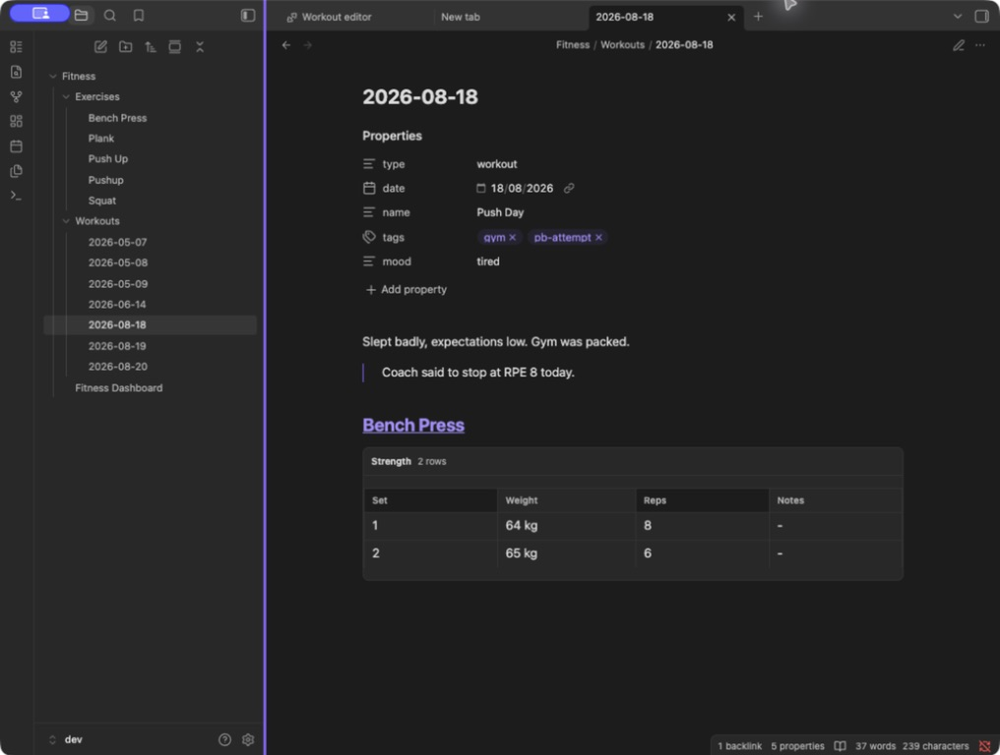

# Note format

Everything FitKit stores is a normal Markdown note. This page describes the shapes it reads and writes, so you can hand-edit with confidence or query your training data with your own Dataview queries.

## Workout notes

A note is a workout when its frontmatter carries `type: workout`. FitKit also writes `date:` and `name:`.

```markdown
---
type: workout
date: 2026-05-12
name: Squat Day
tags:
  - gym
---

## [[Squat]]

- [exercise:: [[Squat]]] [notes:: felt heavy] [next:: up 2.5]
- [exercise:: [[Squat]]] [set:: 1] [weight:: 50] [reps:: 5]
- [exercise:: [[Squat]]] [set:: 2] [weight:: 55] [reps:: 5]

## [[Plank]]

- [exercise:: [[Plank]]] [duration:: 60]

## [[Push Up]]

- [exercise:: [[Push Up]]] [notes:: elbows in]
- [exercise:: [[Push Up]]] [set:: 1] [level:: 2] [reps:: 8]
- [exercise:: [[Push Up]]] [set:: 2] [level:: 2] [reps:: 6] [load:: 10]
```

Dataview inline fields are the canonical format. The recognised ones are:

| Field      | Meaning                                                                 |
| ---------- | ----------------------------------------------------------------------- |
| `exercise` | Wikilink to the exercise. Required on every row.                        |
| `set`      | Set number within the exercise.                                         |
| `weight`   | Weight lifted, in the exercise's unit.                                  |
| `reps`     | Repetitions.                                                            |
| `duration` | Seconds. Always seconds, whatever you typed into the editor.            |
| `level`    | Rung reached, as a 1-based position in the exercise's `levels:` ladder. |
| `load`     | Added weight on a bodyweight set, such as a vest.                       |
| `notes`    | Free text, on an exercise header row or on an individual set.           |
| `next`     | `up`, `down`, or `stay`, with an optional weight change (`up 2.5`).     |

An `## [[Name]]` heading groups the rows beneath it. FitKit treats an H2 as an exercise heading only when the section it introduces contains at least one logged exercise row, which is what lets a `## Session notes` heading sit in a workout note without being mistaken for an exercise.

Fenced code blocks in a workout note are reporting surfaces, not the source of truth.

## What survives a save

The workout editor autosaves by parsing the note and writing it back, so anything the parser does not model would be at risk. It is deliberately conservative:

- Frontmatter keys other than `type`, `date`, and `name` are re-emitted verbatim, including indented continuation lines such as YAML list items.
- Prose, blockquotes, task checkboxes, non-exercise bullets, nested sub-bullets, embeds, tables, and sub-headings are captured at parse time and restored in position.
- Preserved content is anchored to the exercise and row it followed rather than to a line offset, so it lands in the right place and stays put across repeated saves.
- A section heading that is not an exercise heading survives.
- A fenced code block keeps its position and the blank lines either side of it.

The one documented exception is inline fields FitKit does not recognise. `[rpe:: 7]` on an exercise row is dropped the next time the editor saves that note. A `[next:: ...]` value it cannot read is a special case: it is ignored rather than reported, and rewritten to nothing on save like any other unrecognised field.

## Exercise notes

An exercise note is a Markdown file in your exercises folder with `type: exercise` frontmatter. The filename is the display name.

````markdown
---
type: exercise
kind: strength
unit: kg
metric: e1rm
---

## Progress chart

```fitkit-chart
exercise: Squat
```

## Recent sessions

<!-- generated Dataview query -->

## Notes

Your own training notes live here.
````

`kind:` is `strength`, `duration`, or `bodyweight`. `unit:` is `kg` or `lbs` and applies to strength exercises only, as does `metric:`, which selects what the progress chart plots. A bodyweight note carries neither; it carries a `levels:` ladder instead, see [Dashboard and charts](dashboard-and-charts.md#chart-blocks).

FitKit seeds the three sections when it creates a note, and `Sync and repair exercise notes` refreshes them in notes you already have. The `Notes` section is yours; nothing regenerates over it.

A bodyweight note declares its ladder instead of a unit and a metric:

```markdown
---
type: exercise
kind: bodyweight
levels:
  - Incline push-up
  - Push-up
  - Archer push-up
---
```

The `levels:` list names the rungs in the author's order, and a set row's `[level:: N]` is a 1-based position in it. A level the ladder no longer names displays as `Level N`, so renaming or shortening the ladder never orphans a logged set. An exercise with no note of its own can carry its ladder on its registry entry instead, see [Exercise registry](exercise-registry.md#kinds-and-units).

## Reading mode

With the workout editor turned off, or on a note you opened as Markdown, FitKit renders recognised exercise rows as a table in reading mode. Everything else in the note renders as ordinary Markdown.



The screenshot doubles as a picture of the save guarantees above: the `tags` and `mood` frontmatter keys, the paragraph, and the blockquote are all hand-written, and all of them survive a round trip through the editor.

## The dashboard

`Fitness/Fitness Dashboard.md` is generated in full on every rebuild. Treat it as output, not as a note to edit, because your changes will be overwritten. See [Dashboard and charts](dashboard-and-charts.md).
