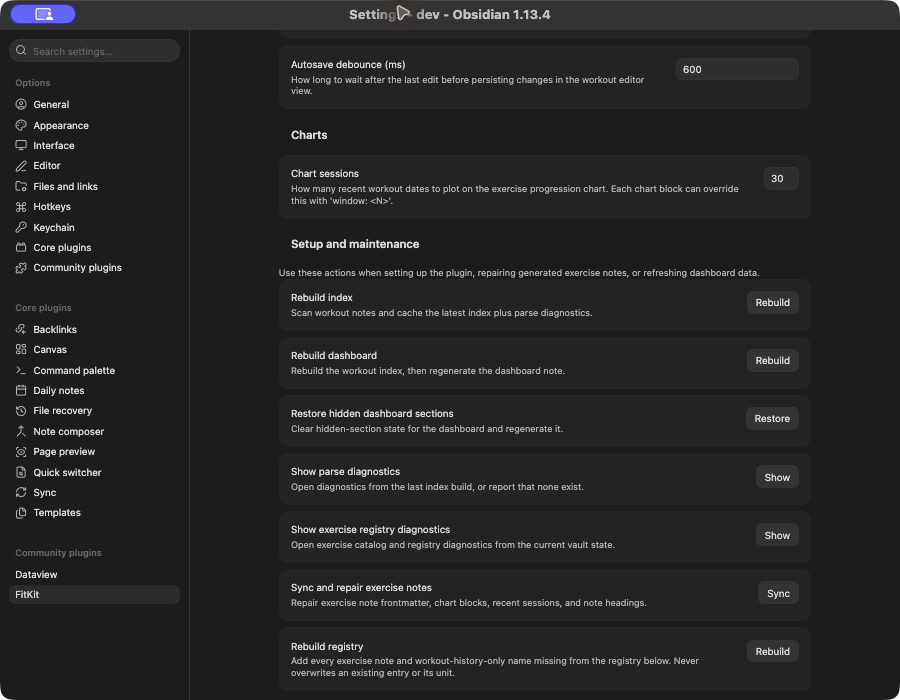

# Settings and maintenance

FitKit works out of the box. Nothing here needs configuring before you log your first workout.

## Paths

`Fitness root` is the only path you set. Everything else is derived from it and shown underneath as you type:

- `Fitness/Workouts/` for workout notes, one per date.
- `Fitness/Exercises/` for exercise notes.
- `Fitness/Fitness Dashboard.md` for the generated dashboard.

Changing the root does not move existing files. Move them yourself first, then point the setting at the new location.

## Behaviour

- `Auto-open workout editor` switches a `type: workout` note into the structured editor when you open it. Turn it off to land in Markdown by default and open the editor deliberately from the command palette.
- `Rest timer` shows the rest timer in the editor footer. It counts up from zero and remembers your last rest after you stop it.
- `Autosave debounce (ms)` is how long the editor waits after your last edit before writing. It defaults to 600, and anything below zero or unparseable resets to that.

## Charts

`Chart sessions` is how many recent workout dates a progression chart plots, defaulting to 30 and clamped between 5 and 365. Any individual chart block can override it with `window: <N>`, see [Dashboard and charts](dashboard-and-charts.md#chart-blocks).

## Setup and maintenance

| Action                               | What it does                                                                                                  |
| ------------------------------------ | ------------------------------------------------------------------------------------------------------------- |
| `Rebuild index`                      | Rescans workout notes and caches the index plus parse diagnostics.                                            |
| `Rebuild dashboard`                  | Rebuilds the index, then regenerates the dashboard note in full.                                              |
| `Restore hidden dashboard sections`  | Clears hidden-section state for the dashboard and regenerates it.                                             |
| `Show parse diagnostics`             | Lists workout notes the last index build could not read cleanly.                                              |
| `Show exercise registry diagnostics` | Reports notes missing a valid `kind:`, and registry entries that disagree with one.                           |
| `Sync and repair exercise notes`     | Refreshes frontmatter, chart blocks, `Recent sessions`, and headings in existing exercise notes.              |
| `Rebuild registry`                   | Adds every exercise note and history-only name missing from the registry. Never overwrites an existing entry. |

None of these rewrite your workout history. `Rebuild dashboard` and `Rebuild registry` are the two that write, and each is additive or fully regenerated output.

## Registry

The registry table sits below the maintenance actions and has its own page, see [Exercise registry](exercise-registry.md).

## Commands

The command palette is kept to daily workout entry:

| Command                                | What it does                                                         |
| -------------------------------------- | -------------------------------------------------------------------- |
| `Open today's workout`                 | Creates today's workout note if needed, then opens it in the editor. |
| `Open workout editor for current file` | Opens the active Markdown file in the editor.                        |

Both are assignable to hotkeys through Obsidian's own hotkey settings.
